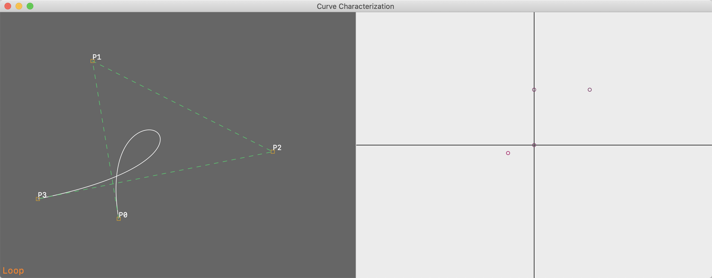

# CurveCharacterization
Implementation of [A Geometric Characterization of Parametric Cubic Curves](http://graphics.pixar.com/people/derose/publications/CubicClassification/paper.pdf)

## Results
### Arch

### One Inflection Point

### Two Inflection Points

### Loop

